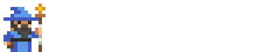
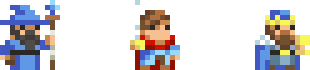

<h1 align="center">Olá, eu sou o Gabriel Teles 👋</h1>

  

  

  

---

### 🚀 O que eu construo

- 🧭 Dev em **São Paulo**, focado em **front-end**.
- ⚡ Construo produtos de **tracking, atribuição de tráfego pago e apostas online**.
- 🎰 **Plataformas de iGaming / apostas online**: cassino, sportsbook e minigames em tempo real.
- 📈 **Tracking e atribuição de tráfego pago**: redirect, atribuição e dashboards (Fastify, Postgres, Redis, BullMQ).
- 🛒 **E-commerce e sites de alta performance**: temas e lojas (Shopify, WordPress, Next.js).

---

### 🧰 Stack

**Linguagens**

**Front-end**

**Back-end e dados**

---

### 📫 Onde me achar

  
  

---

  

